# Photon iMessage platform plugin

Photon lets you text a local Hermes Agent through iMessage. Photon owns the
iMessage/Spectrum delivery layer. Hermes owns the local gateway, agent
execution, and replies.

Photon behaves like any other first-class channel (Telegram, Discord): a
single persistent connection for the lifetime of the gateway. A small
supervised Node sidecar runs the `spectrum-ts` SDK and holds Photon's managed
**gRPC** connection — inbound messages stream over it and outbound replies are
sent through it. There is no webhook and no public tunnel to configure.

Daily runtime needs two pieces running:

- Hermes gateway: runs the agent and supervises the sidecar.
- Photon sidecar: streams iMessage in/out through `spectrum-ts` over gRPC.

The free Photon path uses shared iMessage lines (`type: shared`). If Photon
says no shared numbers are available for your phone, that is a Photon
allocation/rate-limit state, not a Hermes problem.

## Quick Setup

```bash
hermes photon quick-setup --phone '+<country-code><number>'
```

Use E.164 format: `+` plus country code and number, with no spaces. After
setup, text the assigned Photon iMessage number printed at the end (or shown
in the dashboard).

`quick-setup` is idempotent. Run it again after a reset, gateway restart, or
partial setup failure.

`quick-setup` treats the current `HERMES_HOME` as the only Hermes home it may
mutate, and acquires a per-project runtime lock so two gateways never stream
the same Photon project at once. If an installed gateway service points at a
different `HERMES_HOME`, setup starts a temporary gateway for the current home
instead of rewriting that service.

### What Quick Setup Does

| Step | What it checks or changes |
|------|----------------------------|
| 1. Login | Validates the Photon dashboard token, or runs device login (`client_id=photon-cli`). |
| 2. Project | Adopts or creates the "Hermes Agent" Spectrum+iMessage project and stores `PHOTON_PROJECT_ID` / `PHOTON_PROJECT_SECRET`. |
| 3. Phone user | Creates the shared iMessage user for `--phone` if none exists, then authorizes that sender in Hermes. |
| 4. Sidecar | Verifies Node and installs `plugins/platforms/photon/sidecar` dependencies if needed. |
| 5. Gateway | Enables `platforms.photon` and starts (or restarts) the current-home gateway. |
| 6. Runtime | Confirms the gateway reports `photon=connected` and prints the assigned iMessage number. |

Verbose mode streams useful logs while setup waits:

```bash
hermes photon quick-setup -v --phone '+<country-code><number>'
```

## Message Flow

```mermaid
flowchart TB
    subgraph INBOUND["Inbound: iMessage to Hermes"]
        direction LR
        IN1["Your iMessage app"] --> IN2["Photon assigned iMessage number"]
        IN2 --> IN3["Photon Spectrum cloud"]
        IN3 --> IN4["spectrum-ts gRPC stream (app.messages)"]
        IN4 --> IN5["Node sidecar -> NDJSON on stdout"]
        IN5 --> IN6["Hermes adapter reader task"]
        IN6 --> IN7["Hermes agent receives message"]
    end

    subgraph OUTBOUND["Outbound: Hermes to iMessage"]
        direction LR
        OUT1["Hermes agent reply"] --> OUT2["Hermes adapter (NDJSON on stdin)"]
        OUT2 --> OUT3["Node sidecar -> spectrum-ts space.send"]
        OUT3 --> OUT4["Photon Spectrum cloud"]
        OUT4 --> OUT5["Photon assigned iMessage number"]
        OUT5 --> OUT6["Your iMessage app"]
    end
```



### Inbound

1. You send an iMessage to Photon's assigned number.
2. Photon delivers it on the SDK's `app.messages` gRPC stream inside the sidecar.
3. The sidecar emits a normalized NDJSON `message` event on stdout.
4. The Python adapter parses it, dedupes by message id, and dispatches it to
   the agent.

### Outbound

1. Hermes produces a reply.
2. The Python adapter writes an NDJSON `send` command to the sidecar's stdin.
3. The sidecar uses `spectrum-ts` (`space.send`) to send through Photon.
4. Photon delivers the message back to iMessage.

## Why The Sidecar Exists

`spectrum-ts` is a TypeScript SDK with no Python equivalent. The sidecar is a
small supervised Node process that runs `spectrum-ts` and speaks a tiny
line-delimited JSON protocol to the Python adapter over stdio. See
`sidecar/README.md` for the protocol.

## Runtime Commands

```bash
hermes photon status
hermes gateway run -v
hermes gateway install --force
hermes gateway start
```

Use `hermes photon status` first. Its final row is the computed next step.

Use `hermes gateway run -v` for foreground debugging. Use
`hermes gateway install --force && hermes gateway start` for always-on
background runtime. Do not run both at the same time.

## Logs

`quick-setup -v` streams the useful Photon/Gateway logs while it waits:

```bash
hermes photon quick-setup -v --phone '+<country-code><number>'
```

Main log files:

| Log | Path | Use |
|-----|------|-----|
| Gateway | `~/.hermes/logs/gateway.log` | Gateway startup, Photon connect state, inbound/outbound activity. |
| Errors | `~/.hermes/logs/errors.log` | Warnings and errors across Hermes runtime. |
| Gateway errors | `~/.hermes/logs/gateway.error.log` | Gateway-focused warnings and failures. |

The sidecar's own diagnostics are logged via the gateway under the
`[photon-sidecar]` prefix.

## Project And Phone Commands

```bash
hermes photon allow-phone '+<country-code><number>'
hermes photon projects list
hermes photon projects select <dashboard-or-spectrum-project-id>
hermes photon quick-setup --new-project --phone '+<country-code><number>'
```

Use `--new-project` only when you intentionally want a separate Photon
dashboard project. It will not fix shared-line exhaustion for a phone that
Photon has already rate-limited.

## Reset

```bash
hermes photon reset
hermes photon reset --all
```

`reset` clears local Photon project credentials and lets `quick-setup` rebuild
them. `reset --all` asks you to type `PHOTON`, then also clears the dashboard
token, sender allowlist, and home-channel state. Neither command deletes the
Photon project itself.

## Credentials

Photon state lives in `~/.hermes/.env`:

```bash
PHOTON_DASHBOARD_TOKEN=...
PHOTON_PROJECT_ID=...
PHOTON_PROJECT_SECRET=...
PHOTON_ALLOWED_USERS=...
```

See `plugin.yaml` for the full env var list.

## Current Limitations

- Attachments are surfaced as metadata only (the SDK exposes attachment bytes,
  so an on-demand fetch is a possible follow-up).
- Outbound attachments are not wired yet.
- True threaded replies need Photon SDK reply support in the sidecar.
- Reactions, effects, and polls are not exposed through Hermes yet.
- One gateway per Spectrum project at a time (enforced by a runtime lock).

[photon]: https://photon.codes/
