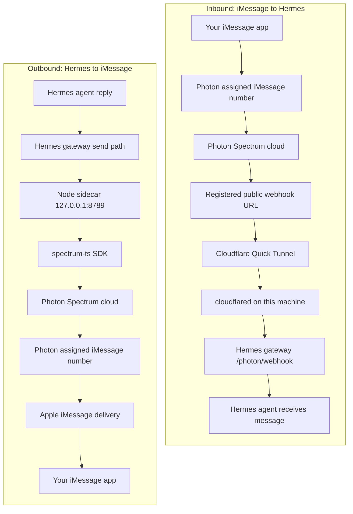

# Photon iMessage platform plugin

Photon lets you text a local Hermes Agent through iMessage. Photon owns
the iMessage/Spectrum delivery layer. Hermes owns the local gateway,
webhook verification, agent execution, and replies.

Daily runtime needs three pieces running:

- Hermes gateway: receives Photon webhooks and runs the agent.
- Cloudflare tunnel: gives Photon a public URL for your local gateway.
- Photon sidecar: sends outbound iMessage replies through `spectrum-ts`.

The free Photon path uses shared iMessage lines (`type: shared`). If
Photon says no shared numbers are available for your phone, that is a
Photon allocation/rate-limit state, not a Hermes tunnel problem.

## Quick Setup

```bash
hermes photon quick-setup --phone '+<country-code><number>'
```

Use E.164 format: `+` plus country code and number, with no spaces.
After setup, text the assigned Photon iMessage number shown by Photon or
the dashboard.

`quick-setup` is idempotent. Run it again after a reset, tunnel change,
gateway restart, or partial setup failure.

`quick-setup` treats the current `HERMES_HOME` as the only Hermes home it may
mutate. That makes multi-home behavior explicit:

- If the Photon active-home record already belongs to another Hermes home,
  setup stops. Hermes does not steal ownership or delete/mutate another
  home's webhook, tunnel, or gateway state.
- If an installed gateway service points at another Hermes home, setup does
  not reuse or rewrite that service. When the local ports are free, it starts
  a temporary gateway for the current home.
- If the webhook port or sidecar port is already owned by another process or
  another home's gateway, setup stops and reports the owner. It does not kill
  arbitrary processes or guess which home should win.
- If you run setup in the default home, or in a different `HERMES_HOME` with
  free/non-conflicting ports, setup should complete and prove local health,
  public health, and `photon=connected`. For concurrent test homes, set
  separate `PHOTON_WEBHOOK_PORT` and `PHOTON_SIDECAR_PORT`; otherwise only one
  gateway can use the defaults.

### What Quick Setup Does

| Step | What it checks or changes |
|------|----------------------------|
| 1. Login | Validates the Photon dashboard token, or runs device login. |
| 2. Project | Adopts or creates a Spectrum+iMessage project and stores `PHOTON_PROJECT_ID` / `PHOTON_PROJECT_SECRET`. |
| 3. Home owner | Stops if another Hermes home owns the Photon runtime state; otherwise records this `HERMES_HOME` as owner. |
| 4. Phone user | Creates or verifies the shared iMessage user for `--phone`, then authorizes that sender in Hermes. |
| 5. Sidecar | Verifies Node and installs `plugins/platforms/photon/sidecar` dependencies if needed. |
| 6. Tunnel | Starts or reuses Cloudflare Quick Tunnel for the local webhook listener. |
| 7. Webhook | Registers the current public `/photon/webhook` URL with Photon and saves its signing secret. |
| 8. Gateway | Enables `platforms.photon`, starts or restarts only the current-home Hermes gateway when runtime secrets changed, and confirms the Photon adapter connects. |
| 9. Proof | Waits for local health, public health, and `photon=connected`. |

Verbose mode streams useful logs while setup waits:

```bash
hermes photon quick-setup -v --phone '+<country-code><number>'
```

## Message Flow



### Inbound

1. You send an iMessage to Photon's assigned number.
2. Photon posts a signed webhook to the registered public URL.
3. Cloudflare forwards that request to the local Hermes gateway.
4. Hermes verifies `X-Spectrum-Signature`, rejects stale timestamps,
   dedupes by message id, and dispatches the message to the agent.

### Outbound

1. Hermes produces a reply.
2. The Python adapter sends the reply to the loopback-only Node sidecar.
3. The sidecar uses `spectrum-ts` to send through Photon.
4. Photon delivers the message back to iMessage.

## Why The Sidecar Exists

Hermes is Python, but Photon does not currently expose a public HTTP
send-message endpoint. The sidecar is a small supervised Node process
that runs `spectrum-ts` and accepts local-only send/typing requests from
the Python adapter. When Photon ships an HTTP send endpoint, this can be
removed.

The sidecar is not the primary inbound path. It may observe SDK inbound
events, but Hermes treats signed webhooks as the source of truth for
message delivery.

## Why The Tunnel Exists

Photon must reach your local gateway from the public internet. Cloudflare
Quick Tunnel gives your laptop a temporary `trycloudflare.com` URL that
forwards to:

```text
http://127.0.0.1:8788/photon/webhook
```

Quick Tunnel URLs can change after restarts. `quick-setup` and the
gateway register the current URL and avoid deleting user-owned/manual
webhooks.

For production or a stable URL, register your own reverse proxy instead:

```bash
hermes photon webhook register https://YOUR-PUBLIC-URL/photon/webhook
```

## Runtime Commands

```bash
hermes photon status
hermes gateway run -v
hermes gateway install --force
hermes gateway start
```

Use `hermes photon status` first. Its final row is the computed next
step.

Use `hermes gateway run -v` for foreground debugging. Use
`hermes gateway install --force && hermes gateway start` for always-on
background runtime. Do not run both at the same time.

## Logs

`quick-setup -v` streams the useful Photon/Gateway logs while it waits:

```bash
hermes photon quick-setup -v --phone '+<country-code><number>'
```

Main log files:

| Log | Path | Use |
|-----|------|-----|
| Gateway | `~/.hermes/logs/gateway.log` | Gateway startup, Photon connect state, inbound/outbound activity. |
| Errors | `~/.hermes/logs/errors.log` | Warnings and errors across Hermes runtime. |
| Gateway errors | `~/.hermes/logs/gateway.error.log` | Gateway-focused warnings and failures. |
| Cloudflare tunnel | `~/.hermes/photon/cloudflared.log` | Quick Tunnel startup, reconnects, public URL failures. |

Useful commands:

```bash
hermes logs --follow
hermes logs --level warning
hermes photon webhook tunnel logs
```

On gateway startup, Photon logs the active Hermes home. It should match
the `HERMES_HOME` where you ran `hermes photon quick-setup`.

## Project And Phone Commands

```bash
hermes photon allow-phone '+<country-code><number>'
hermes photon projects list
hermes photon projects select <dashboard-or-spectrum-project-id>
hermes photon quick-setup --new-project --phone '+<country-code><number>'
```

Use `--new-project` only when you intentionally want a separate Photon
dashboard project. It will not fix shared-line exhaustion for a phone
that Photon has already rate-limited.

## Tunnel Commands

```bash
hermes photon webhook tunnel start
hermes photon webhook tunnel status
hermes photon webhook tunnel logs
hermes photon webhook tunnel stop
```

Common public-health failures:

- `HTTP 502`: Cloudflare reached the tunnel before the gateway was ready.
- `explicit DNS fallback via ...`: the macOS system resolver did not resolve
  the Quick Tunnel hostname, but Hermes verified the same URL with an
  explicit DNS result. This is acceptable for local setup; do not churn the
  tunnel just for this status.
- `system DNS failed` or `HTTP 530`: this Mac still cannot verify the current
  Quick Tunnel hostname. Check DNS/network settings and rerun setup. Stop and
  start the managed tunnel only when you intentionally want a fresh URL:
  `hermes photon webhook tunnel stop && hermes photon webhook tunnel start`.
- Extra stale managed webhooks: cleanup noise unless the current URL is
  missing or unregistered.

## Reset

```bash
hermes photon reset
hermes photon reset --all
```

`reset` clears local Photon runtime state and lets `quick-setup` rebuild
it. It does not delete remote Photon webhooks.

`reset --all` asks you to type `PHOTON`. It may delete webhooks recorded
as owned by this Hermes home, clear Photon credentials, clear sender
allowlist state, stop the tunnel, and remove the dashboard token. It does
not delete unowned webhooks or another Hermes home's gateway state.

## Credentials

Photon state lives in `~/.hermes/.env`:

```bash
PHOTON_DASHBOARD_TOKEN=...
PHOTON_PROJECT_ID=...
PHOTON_PROJECT_SECRET=...
PHOTON_WEBHOOK_SECRET=...
PHOTON_WEBHOOK_PUBLIC_URL=...
PHOTON_ALLOWED_USERS=...
```

See `plugin.yaml` for the full env var list.

## Current Limitations

- Attachments are metadata-only on inbound webhooks.
- Outbound attachments are not wired yet.
- True threaded replies need Photon SDK reply support in the sidecar.
- Reactions, effects, and polls are not exposed through Hermes yet.

[photon]: https://photon.codes/
